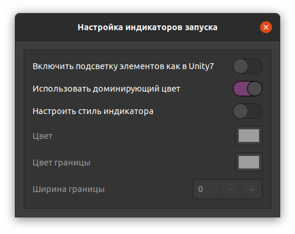
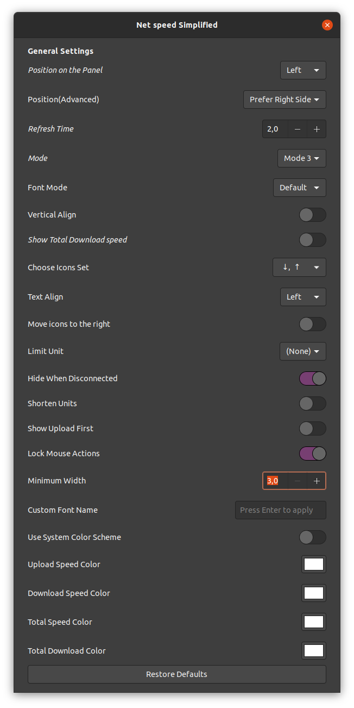
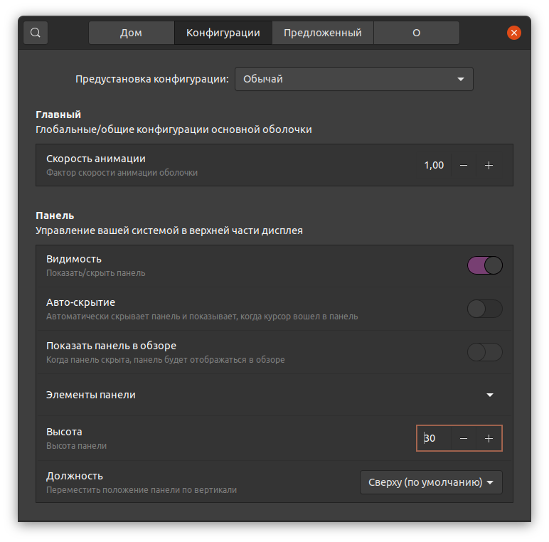
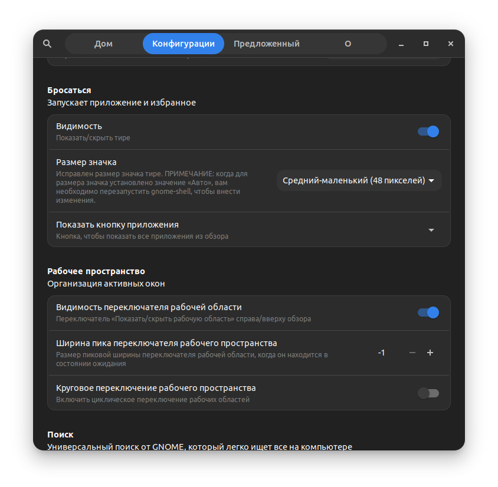
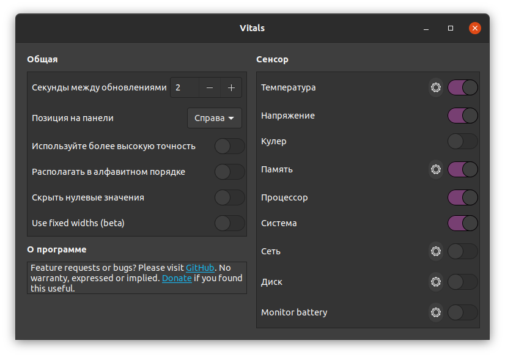

# установка git

```bash
cd
```

```bash
sudo apt install apt-transport-https
```

```bash
sudo apt install git
```

```bash
sudo apt update && sudo apt upgrade
```

# установка ohmyzsh

```bash
cd
```

```bash
sudo apt install curl
```
```bash
sudo apt install zsh
```

```bash
sh -c "$(curl -fsSL https://raw.github.com/ohmyzsh/ohmyzsh/master/tools/install.sh)"
```

```bash
git clone https://github.com/powerline/fonts.git
```

```bash
cd fonts
```

```bash
./install.sh
```

```bash
cd
```

```bash
rm -r fonts
```

```bash
sudo apt update && sudo apt upgrade
```

# установка ROS

```bash
cd
```

```bash
sudo sh -c 'echo "deb http://packages.ros.org/ros/ubuntu $(lsb_release -sc) main" > /etc/apt/sources.list.d/ros-latest.list'
```

```bash
curl -s https://raw.githubusercontent.com/ros/rosdistro/master/ros.asc | sudo apt-key add -
```

```bash
sudo apt update && sudo apt upgrade
```

```bash
sudo apt install ros-noetic-desktop-full
```

```bash
echo "source /opt/ros/noetic/setup.zsh" >> ~/.zshrc
```

```bash
sudo apt install python3-rosdep python3-rosinstall python3-rosinstall-generator python3-wstool build-essential
```

```bash
sudo apt install python3-rosdep
```

```bash
sudo rosdep init
```

```bash
rosdep update
```

```bash
sudo apt install python-is-python3
```

```bash
sudo apt update && sudo apt upgrade
```

## установка нужных пакетов для ROS

```bash
cd
```

```bash
sudo apt install ros-noetic-dwa-local-planner
```

```bash
sudo apt install ros-noetic-move-base
```

```bash
sudo apt install ros-noetic-amcl
```

```bash
sudo apt install ros-noetic-gmapping
```

```bash
sudo apt-get install ros-noetic-map-server
```

```bash
sudo apt-get install ros-noetic-ros-control ros-noetic-ros-controllers
```

```bash
sudo apt-get install ros-noetic-joy
```

```bash
sudo apt-get install libspnav-dev
```

```bash
sudo apt update && sudo apt upgrade
```

## установка turtle-bot (пакеты для catkin_ws)

```bash
cd
```

```bash
mkdir -p ~/catkin_ws/src
```

```bash
cd catkin_ws/src
```

```bash
git clone https://github.com/ROBOTIS-GIT/turtlebot3.git -b noetic-devel
```

```bash
git clone https://github.com/ROBOTIS-GIT/turtlebot3_simulations.git -b noetic-devel
```

```bash
git clone https://github.com/ROBOTIS-GIT/turtlebot3_msgs.git -b noetic-devel
```

```bash
cd ~/catkin_ws
```

```bash
catkin_make
```

```bash
cd
```

```bash
echo "source ~/catkin_ws/devel/setup.zsh" >> ~/.zshrc
```

```bash
sudo apt update && sudo apt upgrade
```

# установка nautilus (открывать папки и файлы как админ)

```bash
sudo apt install -y nautilus-admin
```

```bash
nautilus -q
```

```bash
sudo apt update && sudo apt upgrade
```

# установка ssh

```bash
sudo apt-get install ssh
```

```bash
sudo apt install openssh-server
```

```bash
sudo apt install net-tools
```

```bash
sudo apt update && sudo apt upgrade
```

# расширенные настройки системы

```bash
sudo apt-get install gnome-tweaks
```

# установка speedtest

```bash
sudo apt-get install python3-pip
```

```bash
sudo pip install speedtest-cli
```

```bash
speedtest
```

```bash
sudo apt update && sudo apt upgrade
```

# установка cmatrix

```bash
sudo apt install cmatrix
```

```bash
cmatrix
```

```bash
sudo apt update && sudo apt upgrade
```

# делу время - потехе час! (устанавливаем steam)

```bash
sudo apt install steam
```

```bash
sudo apt update && sudo apt upgrade
```

# отсюда рекомендуется качать телегу

[ссылка на сайт](https://desktop.telegram.org/?setln=ru)

# отсюда рекомендуется качать VS Code

[ссылка на сайт - выбираем .deb](https://code.visualstudio.com/download)

# тут можно качнуть UI-версию github-desktop
[ссылка на реп - выбираем .deb](https://github.com/shiftkey/desktop/releases)

# терминальный мультиплексор tmux

```bash
sudo apt install tmux
```

* создаем конфиг-файл

```bash
touch ~/.tmux.conf
```

* назначаем комбинацию CTRL + q как командную

```bash
echo "set-option -g prefix C-q" >> ~/.tmux.conf
```

* делаем возможным масштабировать терминалы мышкой

```bash
echo "set -g mouse on" >> ~/.tmux.conf
```

# включение гибернации в linux

[проверить размер swap-файла (если он меньше оперативы - надо делать размером с нее)](https://andreyex.ru/ubuntu/kak-uvelichit-razmer-swap-v-ubuntu/)

[ссылка на статью](https://www.linuxuprising.com/2021/08/how-to-enable-hibernation-on-ubuntu.html)

# работа с dualshock4 и другими геймпадами

[драйвер ds4drv](https://github.com/chrippa/ds4drv)

[установка jstest-gtk (прога для проверки/настройки)](https://onstartup.ru/utility/jstest-gtk/)

# расширения

## включение жестов

[в видосе чувак подсказывает](https://www.youtube.com/watch?v=81k9rARXW4Q)

```bash
sudo add-apt-repository ppa:touchegg/stable
```

```bash
sudo apt install touchegg
```

```bash
systemctl status touchegg.service && systemctl start touchegg.service
```

```bash
sudo apt install flatpak
```

```bash
sudo apt install gnome-software-plugin-flatpak
```

```bash
sudo apt install gnome-shell-extension-manager
```

# расширения

## Burn My Windows

<p align="center">

</p>

## Clipboard Indicator

<p align="center">

</p>

## Dash to Dock

<p align="center">

</p>

<p align="center">

</p>

<p align="center">

</p>

<p align="center">

</p>

## Net speed Simplified

<p align="center">

</p>

## OpenWeather

<p align="center">

</p>

<p align="center">

</p>

<p align="center">

</p>

<p align="center">

</p>

<p align="center">

</p>

<p align="center">

</p>

## Public IP

<p align="center">

</p>

## Shell Configurator

<p align="center">

</p>

<p align="center">

</p>

## Vitals

<p align="center">

</p>

## X11 Gestures

<p align="center">

</p>
